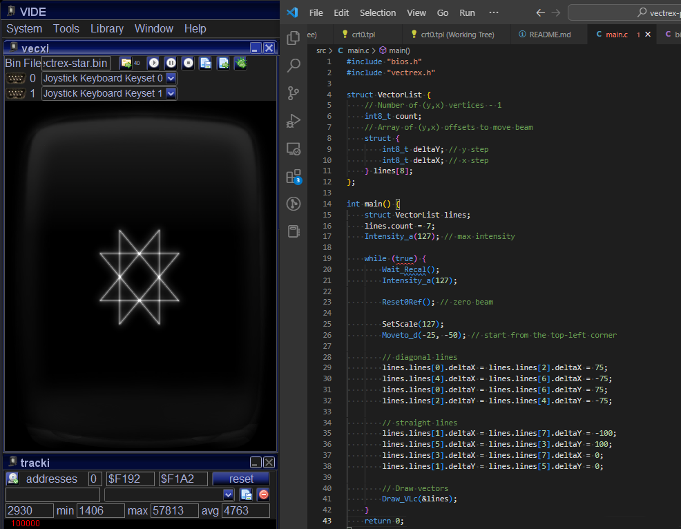

# A minimalist vector star for Vectrex

This is a C sample for the Vectrex started from [amaiorano's Vectrex Pong](https://github.com/amaiorano/vectrex-pong).



# Building

The easiest way to build the game is to use the [amaiorano's docker image](https://github.com/amaiorano/gcc6809-docker) with the gcc6809 cross-compiler and dev tools:

```bash
docker pull amaiorano/gcc6809
git clone https://github.com/lmartorella/vectrex-minimalist-star.git
cd vectrex-minimalist-star
docker run -v $(pwd):/root/vectrex-minimalist-star -t -i amaiorano/gcc6809 make -C vectrex-minimalist-star
```

**Note:** On Windows (using Docker Desktop), replace ```$(pwd)``` with ```%cd%```.

